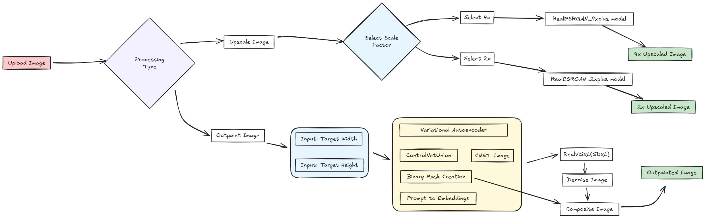
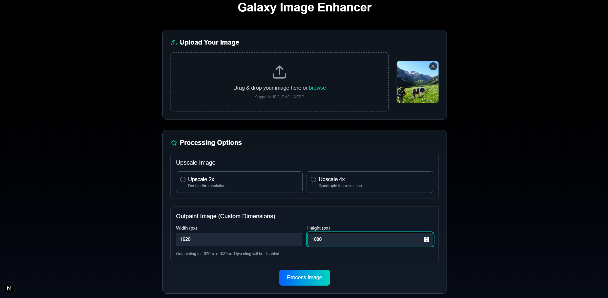
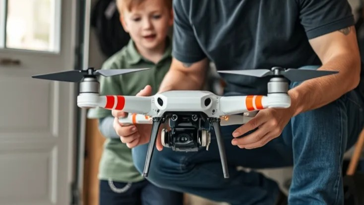
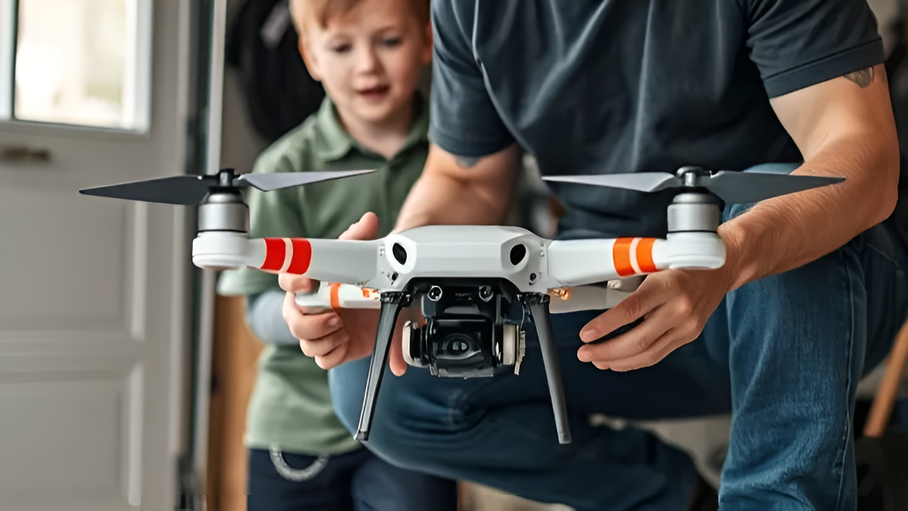
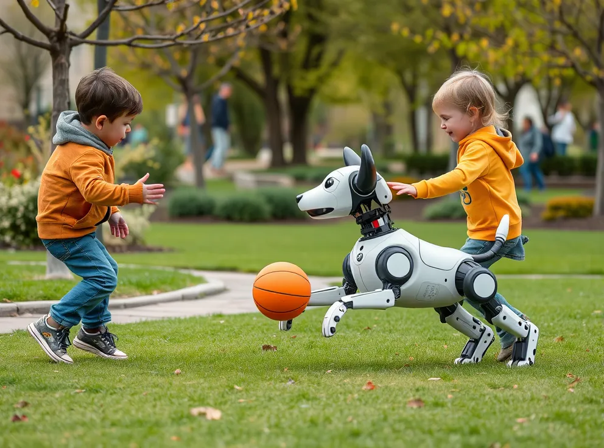
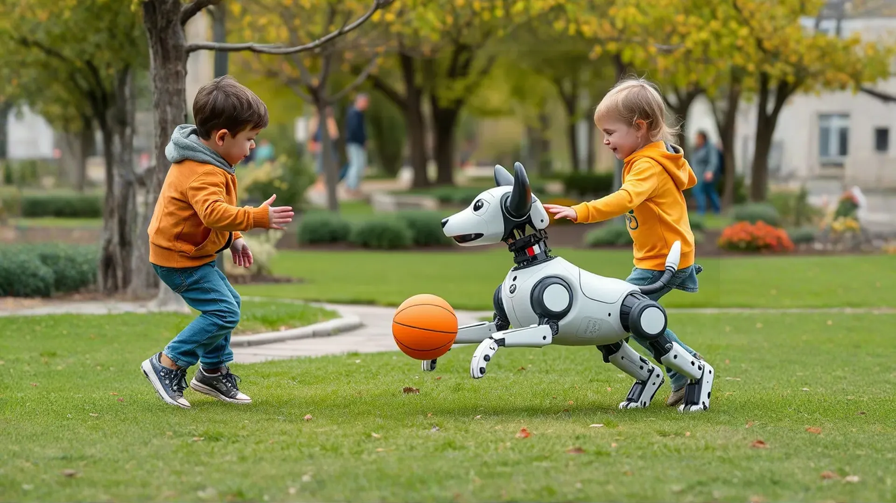
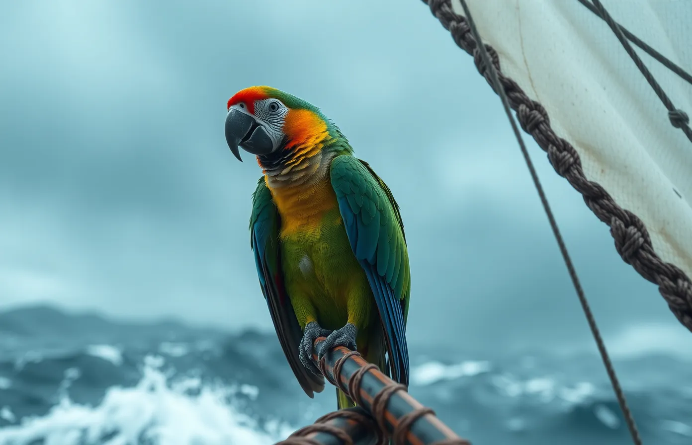
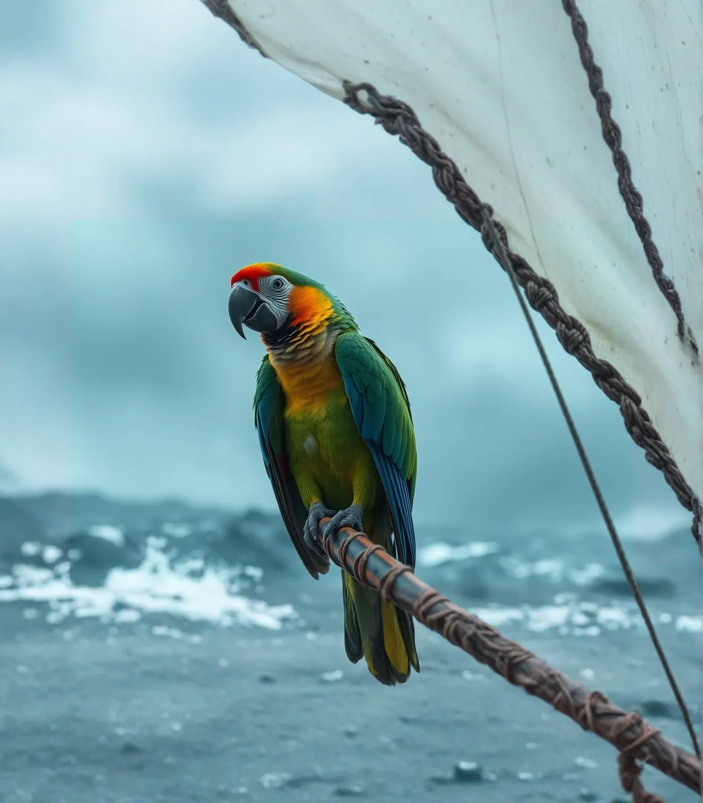

# VITC_24GAI15VITC_GenAI_Image_Resizers

This project provides a powerful service for advanced image manipulation, featuring two core functionalities: high-fidelity image upscaling using **Real-ESRGAN** and intelligent image outpainting with a **Stable Diffusion XL (SDXL) pipeline**.

The application is built with FastAPI, providing a robust and easy-to-use API for frontend applications.

---

## 📂 Project Structure

The repository is organized as follows:

```
.
├── ImageResizer-Server/
│   ├── Real-ESRGAN-master/
│   ├── weights/
│   ├── main.py
│   └── requirements.txt
├── ImageResizer-Webapp/
│   └── ... (Next.js components and pages)
├── documents/
│   ├── monthly connect ppts/
│   ├── pipeline_flowchart_wide.png
│   └── 24GAI15VITC_Demonstration.mov
├── flux-images-outpaint-results/
│   └── ... (Sample input and sdxl outpainted images)
├── run-notes.txt
├── sdxl-output.ipynb
├── docker-compose.yml
└── README.md
```

---

## 🏗️ Architecture

This the architecture of the system.



---

## 🤖 Model Descriptions

This project leverages two state-of-the-art AI models for image processing.

### Image Upscaling: Real-ESRGAN

* **Real-Enhanced Super-Resolution Generative Adversarial Network (Real-ESRGAN)** is used for restoring and upscaling low-resolution images.
* It excels at handling real-world images with complex degradations.
* We utilize two pre-trained models:
    * `RealESRGAN_x4plus`: For upscaling images by a factor of 4.
    * `RealESRGAN_x2plus`: For upscaling images by a factor of 2.

### Image Outpainting: SDXL ControlNet Union

* **Image Outpainting** (or canvas extension) is achieved using a powerful **Stable Diffusion XL (SDXL)** pipeline. This technique intelligently generates new pixels to expand an image beyond its original boundaries, creating a larger, coherent picture.

* The pipeline is composed of several key components working in unison:
    * **Base Model (`SG161222/RealVisXL_V5.0_Lightning`):** This is the core generative model responsible for creating the image content. It's a "lightning" version, optimized for speed and efficiency without significant loss of quality.
    * **VAE (`madebyollin/sdxl-vae-fp16-fix`):** The Variational Autoencoder translates the image into a latent space where the model can work and then decodes it back into a viewable image. This specific VAE is optimized for FP16 precision, preventing common artifacts and ensuring high-quality output.
    * **ControlNet (`xinsir/controlnet-union-sdxl-1.0`):** This is the crucial component for outpainting. It conditions the generation process on the original image, ensuring that the newly generated pixels are contextually aware and blend seamlessly with the existing content, maintaining consistency in style, lighting, and subject matter.

---

## 🚀 Setup and Installation
Refer to (`run-notes.txt`) in the root directory.
To get the project running locally, follow these steps:

1.  **Clone the repository:**
    ```bash
    git clone https://github.ecodesamsung.com/SRIB-PRISM/VITC_24GAI15VITC_GenAI_Image_Resizers.git
    cd VITC_24GAI15VITC_GenAI_Image_Resizers
    ```

2.  **Create a virtual environment and activate it:**
    ```bash
    python -m venv venv
    source venv/bin/activate  # On Windows use `venv\Scripts\activate`
    ```

3.  **Install dependencies:**
    ```bash
    pip install -r requirements.txt
    ```

4.  **Download Model Weights:**
    The Real-ESRGAN model weights already exist in 
    ```bash
    ImageResizer-Server\
    |── Real-ESRGAN-master\
    |   └── weights\
    |       ├── RealESRGAN_x4plus.pth
    |       └── RealESRGAN_x2plus.pth

    ```

    *The SDXL and ControlNet models will be downloaded automatically from Hugging Face on the first run.*

---

### ▶️ Running the Application

Once the setup is complete, you can start the backend server.

1.  **Start the FastAPI server:**
    ```bash
    cd ImageResizer-Webapp
    python -m uvicorn main:app --host 0.0.0.0 --port 8000 --reload
    ```
---

## 🐳 Docker

Run the application using docker.
* Windows requires WSL2 and Nvidia-Container-Toolkit installed to run the container.
* `.wslconfig` in User directory needs to be modified for more resource allocation.
    ```bash
    [wsl2]
    memory=8GB  
    processors=10 
    swap=6GB    
    ```

1.  **In the repository root directory:**
    ```bash
    docker compose up
    ```
    * The models will be downloaded from HuggingFaceHub, it will take time to initiate on first run.
    * The docker terminal conflicts with tqdm progress bar, the bar won't show up.
    * Progress bar will not show up during outpaint process as well.
    * Real-ESRGAN model weights are included in the image, so ignore the warning if occurs.

2.  **For future runs if images gets updated in Docker Hub:**
    ```bash
    # Pull the latest versions of the images
    docker compose pull

    # Recreate the containers with the new images
    docker compose up --force-recreate
    ```
**Docker Hub Links:**
* [Docker Hub - Backend](https://hub.docker.com/repository/docker/pojesh/prism_24gai15vitc-backend/general)
* [Docker Hub - Frontend](https://hub.docker.com/repository/docker/pojesh/prism_24gai15vitc-frontend/general)

---

## 🖥️ Frontend Interface

Here's a screenshot of the web application interface:



The frontend provides an intuitive interface for users to:
- Upload images for processing
- Choose upscaling resolutions 2x and 4x
- Specify outpainting dimensions (width, height)
- View and download processed results

---

## ✨ Results Showcase

### Upscaling Results

Here is a comparison of an original image with its 2x and 4x upscaled versions.

| Original (734x413)                                                                      | 2x Upscaled (1468x826)                                                                  | 4x Upscaled (2936x1652)                                                                    |
| :--------------------------------------------------------------------------------------: | :------------------------------------------------------------------------------------: | :----------------------------------------------------------------------------------------: |
|  |  |  |

### Outpainting Results

These examples demonstrate the model's ability to extend the original image canvas.

| 992x736 | 1920x1080 |
|:---:|:---:|
|  |  |


| 1392x896 | 1400x1600 |
|:---:|:---:|
|  |  |


---

## 🔗 Model and Data Sources

* **SDXL Pipeline:** [Hugging Face/VIDraft](https://huggingface.co/spaces/VIDraft/ReSize-Image-Outpainting)
* **Real-ESRGAN:** [GitHub/xinntao](https://github.com/xinntao/Real-ESRGAN)
* **Data:** [Hugging Face/Black-Forest-Labs](https://huggingface.co/black-forest-labs/FLUX.1-schnell)

## Inference Notebook
* **SDXL outpaint notebook** [Kaggle/pojesh](https://www.kaggle.com/code/pojesh/sdxl-output)

---

## 📝 End Note

This project aims to provide a simple yet powerful tool for developers and creators looking to integrate advanced image enhancement features into their applications. Feel free to contribute or raise issues!
